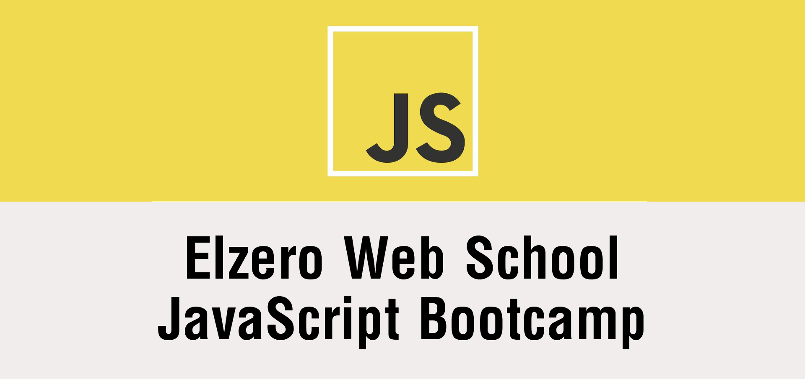

# `Javascript course` 

 
This repo contains the assignment and tasks of [JavaScript Bootcamp ]([https://](https://elzero.org/study/javascript-bootcamp-2021-study-plan/)) 

 

## `Content`
- [Week-one](week-1(Intro)/)
- [Week-two](week-2(data%20Types)/)
- [Week-Four](week-4(number%26string)/)
- [Week-five](week-5(flow%20control)/)
- [Week-Six](week-6(Array)/)
- [Week-Seven](week-7(Loops)/)
- [Week-Eight](week-8(functions)/)
- [Week-Nine](week-9(functions-2)/)
- [Week-Ten](week-10(Higher-Order-Functions)/) 